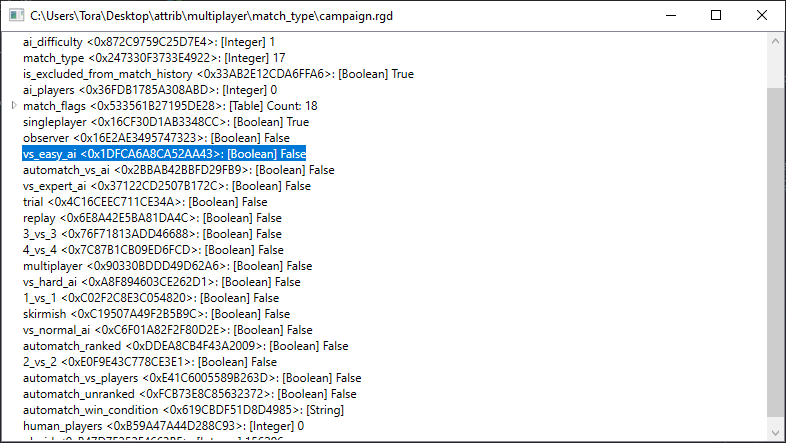

# RGD Reader
This project provides a library, a command line interface too and a graphical user interface for reading Age of Empire 4 RGD files.

Made with C# and .NET 6. The GUI is made with WPF.

The project is mostly in a proof of concept stage right now. It can read all RGD files of AOE4 that I tried. However there are no tests yet and the code is messy.

## Download
See [Releases page](https://github.com/RobinKa/RGDReader/releases) for downloads.

Requires .NET 6 runtime:
- For Windows get https://dotnet.microsoft.com/download/dotnet/thank-you/runtime-6.0.0-windows-x64-installer
- Or see https://dotnet.microsoft.com/download/dotnet/6.0 for a complete list

## Projects
- RGDReader: Library for reading RGDs
- RGDReaderCLI: Command line interface for reading RGD files, takes the rgd path as first argument
- RGDViewer: Graphical user interface for reading RGD files, files can be dragged on the window to view them. Also accepts the rgd path as first command line parameter.